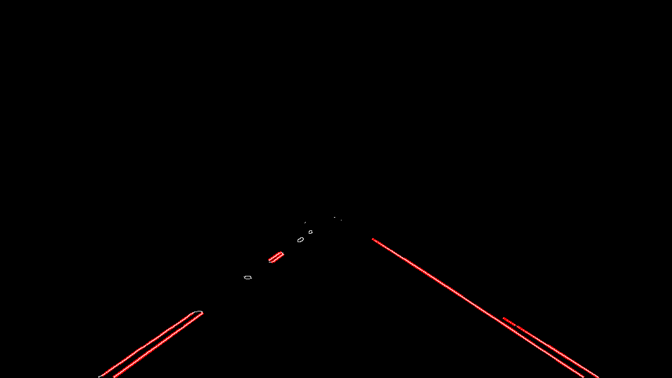

#**Finding Lane Lines on the Road** 

##Writeup 

---

**Finding Lane Lines on the Road**

The goals / steps of this project are the following:
* Make a pipeline that finds lane lines on the road
* Reflect on my work in a written report

[//]: # (Image References)

[image1]: ./examples/grayscale.jpg "Grayscale"

---

### Reflection

###1. Description of the pipeline your pipeline. 

In this pipeline, the following libraries have been used:
numpy
opencv
matplotlib.

The pipeline consist of 5 steps as follows:

####1.1. Reading the source image.

 
####1.2. Converting the source image to a gray scale 

####1.3. Eliminating the fine details using a gaussian mask  to get a blurred image

####1.4. Detecting the edges using Canny edge detection algorithm

####1.5. Determine the Region of Interest "ROI" by making a suitable mask (polygonal mask) then appling this mask on the edges' image

####1.6. Now what we have is some pixels forming some edges, we need to get some lines from these pixels by using Hough Line Transform

Let's have a look now at what the pipline did till this moment on the source image. The piple line extract a group of lines (red lines) at the Region of Interest in the source image.

#### ** 1.7. Untill now dotted lines have been obtained. In this step I will try, in a simple way, to get  two solid lines (lane lines) from the group of lines resulted from Hough Transform as follows: **

##### - 1.7.1. Dividing the lines into two groups, left and right, according to their slopes (left >0.5 and right <-0.5).   

#####- 1.7.2. Determing the most likelihood line (the biggest) in each group and take it as a reference line.(Two lines are obtained, one from left group and the other one from the right group).     
#####- 1.7.3 Find the intersection point between each of these two lines and the upper side and the lowe side of the mask that have been used in 1.5. (Four points are obtained, two points for each line (group)). 

#####- 1.7.4 Drawing new two lines (lane lines) between each of the two points obtained in the previous step.

#####- 1.7.5 Getting the average lines between the lines the we obtained in the previous step and the lane lines of the previous frame.

     

### Lane detection using this pipline [video](white.mp4) and [video](yellow.mp4)
###2. Shortcomings with the current pipeline

The procs of this pipeline is its simplicity ecpecially when we have a straight lines will good vision (lighting) conditions without shodows.     

The cons of this pipline appear when we have a change in lighting conditions such as shadows or when we have a curve lane lines. This pipeline is not robust against these two conditions.
Also, as one can see from the video that the lane lines are not stabe enough they vibrate left and right with a high rate and it will be better of we can make them more stable.

###3. Possible improvements to this pipeline

A possible improvement would be to try to get a more stable solid lines and to solve bad lighting conditions. 

### To get the pipline, please check [Lane_Detection_Pipeline](Lane_Detection_Pipeline.ipynb)